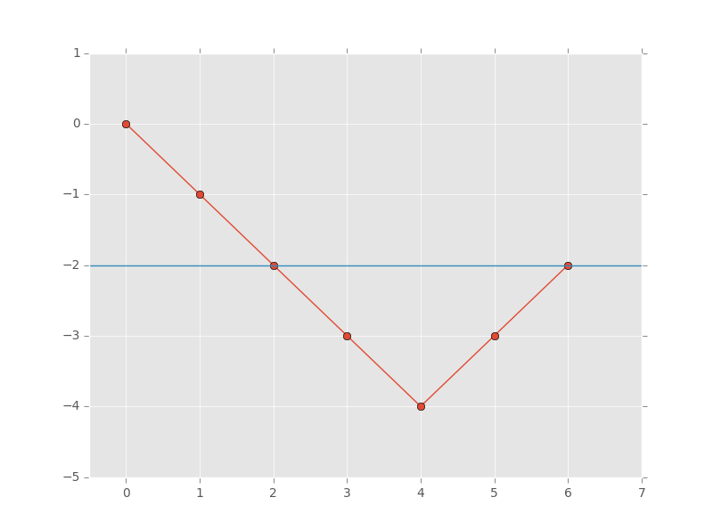

# Medium
## 525. Contiguous Array
Given a binary array nums, return the maximum length of a contiguous subarray with an equal number of 0 and 1.
 
```
Example 1:
Input: nums = [0,1]
Output: 2
Explanation: [0, 1] is the longest contiguous subarray with an equal number of 0 and 1.

Example 2:
Input: nums = [0,1,1,1,1,1,0,0,0]
Output: 6
Explanation: [1,1,1,0,0,0] is the longest contiguous subarray with equal number of 0 and 1.
```

# Key Idea
## Approach 1
**Thought was inspre by 121. Best time to buy and sell stock**
1. Let's have a variable `count` initially equals 0 and traverse through `nums`.
2. Every time we meet 0, we decrease `count` by 1, else increase `count` by 1.

-> we can conculde that two point have same y-axis value indicates the segment between those two positions contains an equal number of `0` and `1`

