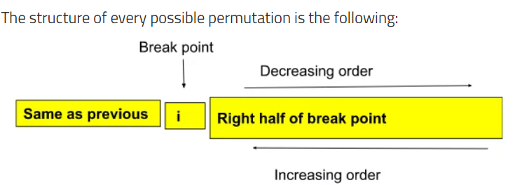

# Medium
## 31. Next Permutation
A permutation of an array of integers is an arrangement of its members into a sequence or linear order.

- For example, for arr = `[1,2,3]`, the following are all the permutations of arr: `[1,2,3], [1,3,2], [2, 1, 3], [2, 3, 1], [3,1,2], [3,2,1].`
- The next permutation of an array of integers is the next lexicographically greater permutation of its integer. 

More formally, if all the permutations of the array are sorted in one container according to their lexicographical order, then the next permutation of that array is the permutation that follows it in the sorted container. If such arrangement is not possible, the array must be rearranged as the lowest possible order (i.e., sorted in ascending order).

- For example, the next permutation of arr = [1,2,3] is [1,3,2].
- Similarly, the next permutation of arr = [2,3,1] is [3,1,2].
- While the next permutation of arr = [3,2,1] is [1,2,3] because [3,2,1] does not have a lexicographical larger rearrangement.
Given an array of integers nums, find the next permutation of nums.

The replacement must be in place and use only constant extra memory.

```
Example 1:
Input: nums = [1,2,3]
Output: [1,3,2]
Example 2:

Input: nums = [3,2,1]
Output: [1,2,3]
```

# Key Idea

## Example:
Given the array:

```
[3, 2, 5, 4, 1]
```

The **next permutation** in **lexicographical order** is:

```
[3, 4, 1, 2, 5]
```

---

### **Step 1: Find the Pivot**
We start looking from the back:
- The subarray `[5, 4, 1]` is already in descending order, meaning it has been fully permuted.
- Since we **cannot swap within this subarray**, we need to swap with a value **before** it.
- The first value before this subarray that we can swap is **`2`**, making it the **pivot**.

**Pivot: `2`**

---

### **Step 2: Swap the Pivot**
To get the next permutation in **lexicographical order**, we must swap `2` with the **smallest number greater than `2`** in `[5, 4, 1]`.
- The numbers in `[5, 4, 1]` that are **greater than `2`** are `{5, 4}`.
- The **smallest of them** is **`4`**.
So, we **swap `2` and `4`**:
```
[3, 4, 5, 2, 1]
```

### **Step 3: Sort the Subarray**
After swapping, we get:
```
[3, 4, 5, 2, 1]
```
This is **not yet the final next permutation** because the part after `4` (`[5, 2, 1]`) is still in **descending order**.
- To get the **smallest next permutation**, we **sort `[5, 2, 1]` in increasing order**:
    ```
    [1, 2, 5]
    ```
- Now, we replace `[5, 2, 1]` with `[1, 2, 5]`, giving us:

```
[3, 4, 1, 2, 5]
```

### ✅ **Final Next Permutation:**  
```
[3, 4, 1, 2, 5]
```

---

### **Summary**
1. **Find the pivot** → The first number (from the right) that is **smaller** than its next → **`2`**.
2. **Find the smallest number larger than the pivot** in the suffix and swap → Swap `2` with **`4`**.
3. **Sort the suffix in ascending order** → Sort `[5, 2, 1]` → `[1, 2, 5]`.

Now, you have the **next permutation in lexicographical order**! 🚀

