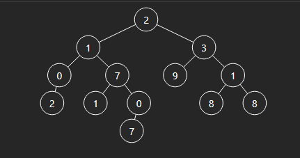

# Medium
## 117. Populating Next Right Pointers in Each Node II
```
struct Node {
  int val;
  Node *left;
  Node *right;
  Node *next;
}
```
Populate each next pointer to point to its next right node. If there is no next right node, the next pointer should be set to `NULL`.

Initially, all next pointers are set to `NULL`.


Example 1:\
Input: root = `[1,2,3,4,5,null,7]`\
Output: `[1,#,2,3,#,4,5,7,#]`\
Explanation: Given the above binary tree (Figure A), your function should populate each next pointer to point to its next right node, just like in Figure B. The serialized output is in level order as connected by the next pointers, with '#' signifying the end of each level.

# Key Idea
## Approach 1 - BFS
**`O(n) time, O(n) space`**
#### [Self scirpt](./self.py) || [Optimize scirpt](./bfs.py)
Similar to approach 1, problem 0116 [[Link]](../0116_populating_net_right_pointer_in_each_node/description.md)
<br />
<br />

## Approach 2 - BFS
**`O(n) time, O(log(n)) space`**\
Example case to check why we need process root.right first:


<br />
<br />
```python
  if not root:
      return root
  def findNext(node):
      while node:
          if node.left:
              return node.left
          if node.right:
              return node.right
          node = node.next
      return None
  if root.left:
      root.left.next = root.right if root.right else findNext(root.next)
  if root.right:
      root.right.next = findNext(root.next)
  self.connect(root.right)  # important
  self.connect(root.left)
  return root
```


## Approach 3 - BFS
**`O(n) time, O(1) space`**
**Explain**: we process lext level while in current level
### Step 1: Level 1 (root level)
Pointer Initialization
  - `head` piont to node `1` (start of the level)
  - `dummy = Node(0)` (to track first node of the next level)
  - `curr = dummy` (move along the next level)

Processing
  - `temp` start at `1`:
    + `curr.next` = 2 (connect `dummy` to `2`)
    + `curr` move to `2`
    + `curr.next` = `3`
    + `curr` move to `3`
  - `temp` move to next = `None`
  - At the end, `head = dummy.next = 2`

### Step 2: Level 2
Pointer initialization
  - `head` is now `2`
  - `dummy = Node(0)`, `curr = dummy`
Processing
  - `temp = 2`
    + `curr.next = 4` (connect `dummy` to `4`)
    + `curr` move to `4`
    + `curr.next = 5`
    + `curr` move to `5`
  - `temp = 3`
    + `curr.next = 7` (connect `5` to `7`)
    + `curr` move to 7
  - `temp` move to next = `None`
  - At the end, `head = dummy.next = 4`

### Step 3: Level 3
Pointer initialize
  - `head` is now `4`
  - `dummy = Node(0)`, `curr = dummy`
  - `temp` = `4`
  - `left` and `right` of temp `None`, move temp to `5`, continue None, move temp to `7`, continue None
  -> `head` = `dummy.next` = `None`
  -> return root


